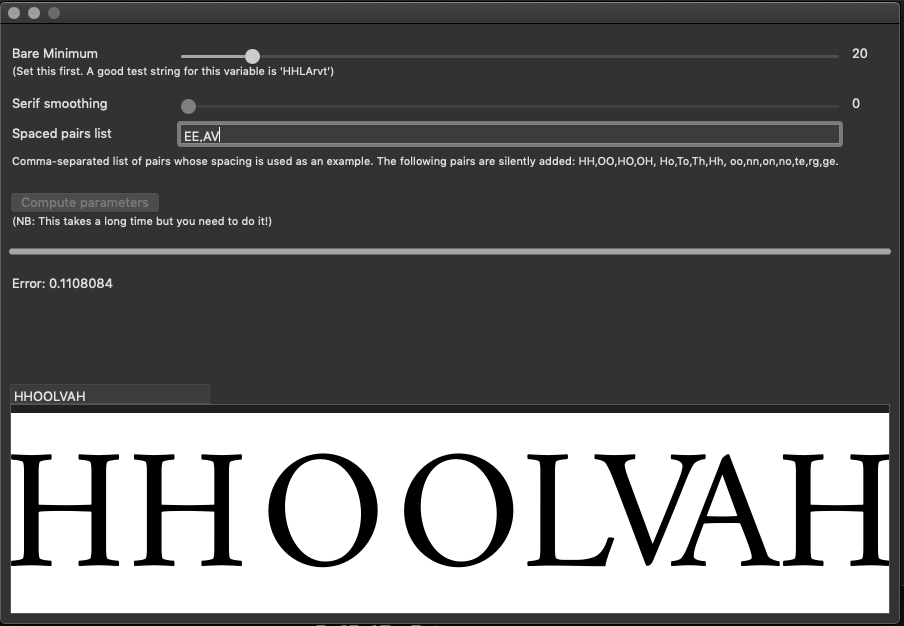

CounterSpace: Automated spacing with counters
=============================================

This is an experimental proof-of-concept automated spacing and kerning tool. For details of how it works, see the [conceptual overview](Spacing_with_countershapes.ipynb). Please note that this is experimental and for research purposes; I wouldn't yet trust it to automatically kern a whole font.

This repository consists of a library which implements the CounterSpace algorithm (`CounterSpace.py`), a Jupyter notebook which demonstrates the algorithm and allows you to "play" with the technique, and a Glyphs script which can be used (with a little preparation) to investigate the technique within your font editor.

Installation
------------

The library can be used in two ways.

If you are using it on the command line or from the Jupyter notebook, then it requires the `tensorfont` library to access glyph information from a TTF or OTF font. It also requires Python 3. Assuming you have Python 3 installed, use the following command to install all needed dependencies:

```
sudo -H pip3 install -r requirements.txt
```

If you are using it within Glyphs, the library will detect this, and no longer requires `tensorfont`. (In turn allowing it to be Python 2 compatible.) However, it will still require a number of other libraries to do the mathematical computations. First, download the following files and place them in the same directory as the Glyphs script:

* https://files.pythonhosted.org/packages/ad/e3/7c8234b15137d2886bbbc3e9a7c83aae851b8cb1e3cf1c3210bdcce56b98/scikit_image-0.14.3-cp27-cp27m-macosx_10_6_intel.macosx_10_9_intel.macosx_10_9_x86_64.macosx_10_10_intel.macosx_10_10_x86_64.whl
* https://files.pythonhosted.org/packages/26/6d/b55e412b5ae437dad6efe102b1a5bdefce4290543bbef78462a7a2037a1e/Pillow-6.1.0-cp27-cp27m-macosx_10_6_intel.macosx_10_9_intel.macosx_10_9_x86_64.macosx_10_10_intel.macosx_10_10_x86_64.whl
* https://files.pythonhosted.org/packages/f2/16/c66bd67f34b8cd2964c2e9914401a27f8cb50398e8cf06ac6e65d80a2c6d/PyWavelets-1.0.3-cp27-cp27m-macosx_10_6_intel.macosx_10_9_intel.macosx_10_9_x86_64.macosx_10_10_intel.macosx_10_10_x86_64.whl

Next, run the following command:

```
sudo /usr/bin/easy_install scikit-image<0.15 numpy
```

This should install what you need.

Playing with the Jupyter notebook
---------------------------------

I'm going to assume you have also [installed Jupyter](https://jupyter.readthedocs.io/en/latest/install.html). Run `jupyter notebook` and open `Spacing_with_countershapes.ipynb`. First, hit "Cell > Run All" and wait. Hopefully you will see no errors and lots of pretty output. Read through each cell to ensure you understand what is going on.

To play with the spacing output, scroll down to the cell beginning "So now we have all the pieces required to space our font." You can change the sample texts in the following cells and run them to see how the spacer copes with different glyph combinations.

You can also change the font, either by pointing CounterSpace at a font of your own (don't forget to also change the `serif_smoothing` factor if appropriate), or by asking it to download one of the sample fonts:

```
CounterSpace.get_sample_font("PTSerif-Italic.ttf")
CounterSpace.get_sample_font("OpenSans-Regular.ttf")
CounterSpace.get_sample_font("Tinos-Italic.ttf")
CounterSpace.get_sample_font("CrimsonRoman.otf")
CounterSpace.get_sample_font("Crimson-SemiboldItalic.otf")
```

Spacing an existing OpenType font
---------------------------------

CounterSpace can be used to space and then kern a font. (As mentioned above, this is an experimental research project. I haven't solved autokerning yet!)

Check out the `autospace.py` script:

```
% python3 autospace.py OpenSans-Regular.ttf
Determining parameters...

Spacing...
A LSB = 67, RSB = 80
...

Kerning...
AA(-14) AB AC(-38) AD AE AF AG(-50)...

Saving OpenSans-Regular-autospaced.ttf
```

Using within Glyphs
-------------------

Once you have the required modules installed (see above), you can use Glyphs to explore the autospacing algorithm. This does not work as well as the command line version, as it relies on horrible hackery to render the glyph outlines to a bitmap. Nevertheless, if you want to try it, place this directory (including the downloaded "wheel" files mentioned above) into your Glyphs `Scripts` directory and run `Script > CounterSpace > CounterSpace`.

The following window should appear:



Clicking on `Compute parameters` will determine the optimal parameters for the spacer. This takes a long time. Finally, in the lower text box, you can enter your own text and Glyphs will render it using the spacings computed by CounterSpace.

Licence and Funding
-------------------

Research and development of CounterSpace was graciously funded by the Google Fonts team. CounterSpace is available under the Apache 2.0 license.